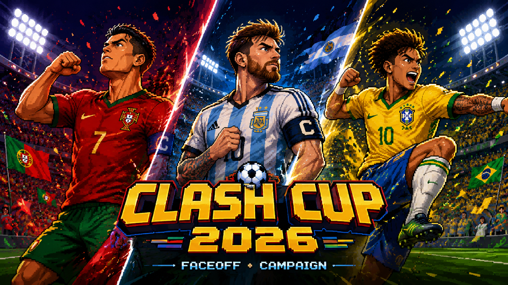

# Clash Cup 2026

  

  <strong>A cinematic soccer faceoff game built for Xavier and William.</strong> 
  Portugal. Argentina. Big moments. One tap at a time.

---

## ⚽ What This Is

**Clash Cup 2026** is a mobile-friendly soccer game built as part of the GOAT Cup 2026 experience.

It is designed as a quick, dramatic, phone-ready game where players can jump into a match, make big choices, and watch the story of the game unfold.

This is not a full soccer simulator.
It is a **cinematic soccer battle game** built around momentum, rivalry, clutch decisions, and World Cup-style drama.

---

## 🔥 Why It’s Cool

Clash Cup turns soccer into a fast, dramatic, turn-based faceoff.

Instead of controlling every pass and every run, players step in during the biggest moments:

* when a team is building an attack
* when a shot is possible
* when a captain can use a special move
* when penalties decide everything
* when the match needs one legendary moment

It is built to feel like a mix of:

**soccer highlights, arcade drama, captain powers, and pass-the-phone competition.**

---

## 🎮 Game Modes

### Faceoff Mode

A two-player pass-the-phone mode where each player takes control of a side.

Perfect for:

* Xavier vs William
* Messi side vs Ronaldo side
* Argentina vs Portugal
* quick rematches
* dramatic penalty shootouts

---

### Campaign Mode

A single-player mode where the player chooses a team and tries to win the tournament.

Campaign mode adds:

* tournament progression
* match drama
* opponent variety
* unlockable-style momentum
* championship pressure

The goal is simple:

> **Win the Clash Cup.**

---

## 🏆 Built For

* **Graduation**
* **World Cup 2026**
* **Twin rivalry**
* **Phone play**
* **Quick soccer battles**

A perfect companion to the main GOAT Cup dashboard.

GOAT Cup is the command center.
Clash Cup is where the rivalry gets settled.

---

## 📱 Features

* **Mobile-Friendly Layout**

  * built for phone screens
  * large tap buttons
  * fast match flow
  * easy pass-the-phone play

* **Turn-Based Soccer Drama**

  * attack choices
  * defensive pressure
  * momentum swings
  * goal chances
  * match events

* **Captain Moments**

  * Portugal captain drama
  * Argentina captain drama
  * special moves
  * clutch shots
  * late-game tension

* **Match Events**

  * goals
  * corners
  * free kicks
  * fouls
  * yellow cards
  * offside calls
  * halftime moments
  * penalties

* **Cinematic Images**

  * team moments
  * referee calls
  * goal scenes
  * captain reactions
  * celebration screens

---

## 🚀 How To Use

1. Open the site
2. Choose a mode:

   * **Faceoff**
   * **Campaign**
3. Pick your side
4. Tap through the match
5. Make the big decisions when they appear
6. Try to win the Clash Cup

---

## 🔗 Part of the GOAT Cup Experience

**Clash Cup 2026** is designed to work alongside the main **GOAT Cup 2026** dashboard.

The recommended setup is:

* **GOAT Cup 2026** = the main app / dashboard
* **Clash Cup 2026** = the playable game

The GOAT Cup dashboard can link directly to Clash Cup with a button like:

> **Play Clash Cup 2026**

This keeps the projects clean, simple, and easy to update.

---

## 🏟️ The Vibe

Fast. Dramatic. Personal.
A little arcade. A little World Cup. A lot of rivalry.

This project is built to feel like:

> **a custom soccer showdown made for two brothers, one legendary summer, and one trophy on the line.**

---

## 👑 Final Word

Xavier. William.
Portugal. Argentina.
GOAT Cup. Clash Cup.

**The whistle blows. The rivalry begins.**
